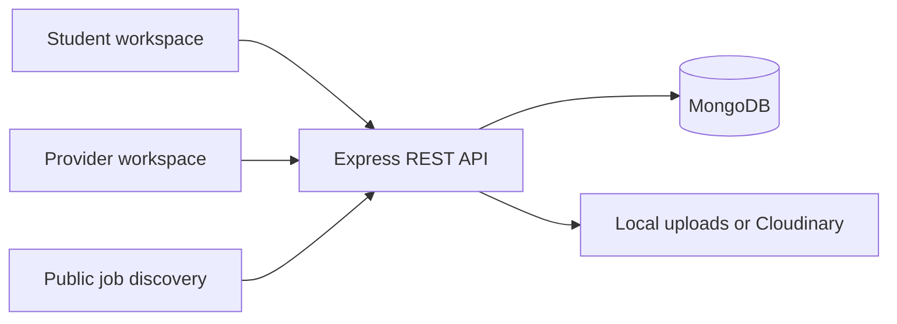

# InternTrack

**Find the right opportunity. Track every application.**

InternTrack is a full-stack MERN application that brings job discovery, application tracking, and recruitment management into one workspace. Students and graduates can organize their career search, while internship and job providers can manage vacancies and candidates throughout the hiring process.

The React frontend connects to an Express API backed by MongoDB. Accounts, opportunities, applications, and notifications are persisted through the API. The application does not include shared demo accounts or seeded business records.

[Getting started](#getting-started) · [Features](#features) · [Architecture](#architecture) · [API overview](#api-overview) · [Testing](#testing) · [Documentation](#documentation)

## Features

### Students and graduates

- Discover internships, full-time jobs, and part-time opportunities.
- Search and filter by keywords, location, work arrangement, category, experience, and skills.
- Save opportunities and apply with a PDF CV and cover letter.
- Track application statuses and history, including interviews and offers.
- Maintain private application notes and withdraw applications.
- Edit an academic profile, skills, preferences, professional links, and profile picture.
- View interviews, meeting links, and calendar exports.
- Organize saved-job deadlines and personal follow-ups in a monthly calendar.
- View application analytics and read/unread notifications.

### Internship and job providers

- Create and edit a company profile and logo.
- Publish, edit, close, and remove owned vacancies, including draft postings.
- Review applicants and filter by application status, university, and skills.
- View candidate profiles, submitted CVs, cover letters, and application history.
- Shortlist or reject candidates, make offers, and maintain private hiring notes.
- Schedule, reschedule, and cancel interviews with candidate notifications.
- View recruitment statistics, application-status charts, and applicants by vacancy.

### Shared experience

- Separate student and provider dashboards with role-protected navigation.
- Responsive layouts, mobile navigation drawers, reusable forms, and dialogs.
- Loading, empty, validation, and error states with toast feedback.
- JWT authentication, password hashing, resource ownership checks, and protected CV downloads.

## Technology stack

| Area                    | Technologies                                        |
| ----------------------- | --------------------------------------------------- |
| Frontend                | React, React Router, Tailwind CSS, Vite             |
| Data and feedback       | Axios, Recharts, React Hot Toast                    |
| Icons                   | Lucide React                                        |
| Backend                 | Node.js, Express                                    |
| Database                | MongoDB, Mongoose                                   |
| Authentication          | JSON Web Tokens, bcrypt                             |
| Validation and security | Express Validator, Helmet, CORS, express-rate-limit |
| Files                   | Multer, local storage, Cloudinary adapter           |
| Development and testing | Nodemon, Prettier, Node test runner, Supertest      |

Application JavaScript uses `.js` files, including React components. Vite transforms JSX in the frontend's `.js` source files.

## Getting started

### Prerequisites

- Node.js **22 or newer**, with npm.
- A running local MongoDB instance or an accessible MongoDB Atlas database.
- Git.

### 1. Clone and install

```sh
git clone https://github.com/Kabi1909/InternTrack.git
cd InternTrack
npm ci --prefix backend
npm ci --prefix frontend
```

The repository has separate frontend and backend packages. Run the commands below from the repository root unless stated otherwise.

### 2. Configure the backend

Copy `backend/.env.example` to `backend/.env`. In PowerShell:

```powershell
Copy-Item backend/.env.example backend/.env
```

On macOS or Linux:

```sh
cp backend/.env.example backend/.env
```

Set your database connection and JWT secret:

```dotenv
PORT=5000
NODE_ENV=development
MONGO_URI=mongodb://127.0.0.1:27017/interntrack
JWT_SECRET=replace_with_a_random_secret_of_at_least_32_bytes
JWT_EXPIRES_IN=7d
CLIENT_URL=http://localhost:5173
UPLOAD_DRIVER=local
```

Generate a random secret with:

```sh
node -e "console.log(require('crypto').randomBytes(48).toString('hex'))"
```

Paste the generated value into `JWT_SECRET` in your local `.env`. Use your Atlas connection string for `MONGO_URI` if using Atlas, and configure its database user and network access. Environment secrets and uploaded files are excluded from Git.

### 3. Start both applications

**Terminal 1 — API**

```sh
npm run dev --prefix backend
```

**Terminal 2 — frontend**

```sh
npm run dev --prefix frontend
```

| Service         | Local address                    |
| --------------- | -------------------------------- |
| Frontend        | http://localhost:5173            |
| API             | http://localhost:5000/api        |
| Database health | http://localhost:5000/api/health |

The Vite development server proxies `/api` requests to port 5000. The frontend defaults to `VITE_API_BASE_URL=/api`, so a frontend `.env` is optional for this local setup.

A successful health response is:

```json
{
  "success": true,
  "data": {
    "database": "connected"
  }
}
```

### 4. Try the recruitment workflow

1. Register as a **Job Provider** and complete your company profile.
2. Publish an opportunity with its requirements and a future deadline.
3. Log out and register as a **Student / Graduate**.
4. Complete your profile, save the opportunity, and apply with a PDF CV.
5. Sign back in as the provider to review and shortlist the candidate.
6. Schedule an interview and check the student's application timeline and notifications.

Use separate browser profiles if you want to keep both roles signed in simultaneously. A new database starts empty; create accounts and vacancies through the application. No seed script runs automatically.

## Environment variables

| Variable                | Purpose                                                         |
| ----------------------- | --------------------------------------------------------------- |
| `MONGO_URI`             | Backend database connection string, including the database name |
| `JWT_SECRET`            | Backend signing secret; at least 32 bytes                       |
| `JWT_EXPIRES_IN`        | Token lifetime; defaults to `7d`                                |
| `PORT`                  | API port; defaults to `5000`                                    |
| `NODE_ENV`              | Backend runtime mode                                            |
| `CLIENT_URL`            | Allowed frontend origins, separated by commas                   |
| `UPLOAD_DRIVER`         | `local` or `cloudinary`; defaults to `local`                    |
| `CLOUDINARY_CLOUD_NAME` | Cloudinary cloud name when using its adapter                    |
| `CLOUDINARY_API_KEY`    | Cloudinary API key                                              |
| `CLOUDINARY_API_SECRET` | Cloudinary API secret                                           |
| `MONGO_TEST_URI`        | Optional MongoDB server URI for integration tests               |
| `VITE_API_BASE_URL`     | Frontend API base URL; defaults to `/api`                       |

Only the `VITE_` variable belongs in the frontend environment. Frontend environment values are included in the browser build; do not put secrets there.

## Architecture

```text
InternTrack/
├── backend/
│   ├── config/          # Environment, database, and Cloudinary configuration
│   ├── controllers/     # HTTP request handling
│   ├── middleware/      # Authentication, authorization, validation, uploads, errors
│   ├── models/          # Mongoose schemas and indexes
│   ├── routes/          # REST endpoint groups
│   ├── services/        # Business logic, analytics, storage, and notifications
│   ├── validators/      # Request validation rules
│   ├── utils/           # Shared response, error, and token helpers
│   ├── tests/           # MongoDB integration tests
│   ├── uploads/         # Ignored local upload storage
│   ├── app.js           # Express application
│   └── server.js        # Startup and shutdown lifecycle
├── frontend/
│   ├── src/
│   │   ├── components/  # Reusable UI and feature components
│   │   ├── context/     # Authentication and workspace state
│   │   ├── data/        # Static category/status options only
│   │   ├── hooks/       # Shared React hooks
│   │   ├── layouts/     # Public, student, and provider layouts
│   │   ├── pages/       # Public and role-specific screens
│   │   ├── services/    # API requests, uploads, and response adapters
│   │   └── utils/       # Formatting and calendar helpers
│   └── tests/           # Frontend API-contract tests
└── README.md
```



The primary models are `User`, `StudentProfile`, `ProviderProfile`, `Job`, `Application`, `SavedJob`, `Interview`, `Notification`, `Upload`, and `Followup`. Student/provider ownership fields consistently reference **User IDs**. Profile documents have separate IDs and a unique `user` relationship.

The frontend keeps API response mapping in service adapters, preserving reusable presentation components. Business records come from the backend; browser storage holds the session token rather than copies of the database.

## API overview

Protected endpoints require:

```http
Authorization: Bearer <JWT>
```

| Route group          | Purpose                                                         |
| -------------------- | --------------------------------------------------------------- |
| `/api/auth`          | Registration, login, current user, and logout                   |
| `/api/users`         | Authenticated account details                                   |
| `/api/students`      | Student profiles, uploads, follow-ups, analytics, and dashboard |
| `/api/providers`     | Company profiles, uploads, analytics, and dashboard             |
| `/api/jobs`          | Public discovery and provider vacancy management                |
| `/api/applications`  | Submissions, status history, withdrawals, and private notes     |
| `/api/saved-jobs`    | Student bookmarks                                               |
| `/api/interviews`    | Scheduling, updates, cancellation, and role-specific lists      |
| `/api/notifications` | Recipient notifications and read state                          |
| `/api/uploads`       | Image delivery and authorized CV downloads                      |

List endpoints support pagination with `page`, `limit`, `total`, and `pages` metadata. Errors use a consistent JSON response with a message and validation details when applicable.

See the [full API reference](backend/API.md) for methods, payloads, filters, permissions, and response fields.

## Authentication and file handling

- Passwords are hashed with bcrypt and excluded from API responses.
- JWT verification checks the signature, expiry, issuer, audience, and token version. The database determines the current user's role.
- Logout revokes the user's existing tokens across devices.
- Ownership checks restrict access to jobs, applications, interviews, and notifications.
- Student personal notes and provider hiring notes are filtered from the other role's responses.
- Unique indexes prevent duplicate saved jobs and duplicate active applications. A withdrawn application can be submitted again while the job remains open.
- CVs accept **PDF up to 5 MB**. Images accept **JPEG, PNG, or WebP up to 2 MB**.
- Uploads are checked by MIME type and file signature. CV downloads require the owning student or the provider associated with an application using that CV.

## Testing

From the repository root:

```sh
npm run check --prefix backend
npm test --prefix backend
npm test --prefix frontend
npm run build --prefix frontend
npm run format:check --prefix backend
npm run format:check --prefix frontend
```

Backend integration tests require MongoDB. Each run creates a unique `interntrack_test_*` database and removes that database and its test uploads afterward. They cover authentication, role/ownership boundaries, job management, applications, CV access, private notes, interviews, notifications, analytics, and token revocation.

Frontend tests cover API field mapping, empty workspaces, identity handling, interview timezone conversion, and paginated data loading. The [verification report](VERIFICATION.md) records the completed automated and browser checks, including mobile layouts.

## Production setup

Build the frontend and start the API with:

```sh
npm run build --prefix frontend
npm start --prefix backend
```

Serve `frontend/dist` with a web host that falls back to `index.html` for React Router routes. Reverse proxy `/api` to the backend, or set `VITE_API_BASE_URL` to your API's HTTPS URL before building. Configure `CLIENT_URL` for the deployed frontend origin. The development proxy is not a production hosting configuration.

Use production secrets, HTTPS, persistent upload storage, and a managed API process. See the [backend deployment considerations](backend/README.md#production-follow-ups) before deployment.

## Troubleshooting

| Problem                       | What to check                                                                                                                                                                        |
| ----------------------------- | ------------------------------------------------------------------------------------------------------------------------------------------------------------------------------------ |
| `EADDRINUSE` on port 5000     | Another API process is already running. Stop it in its original terminal with `Ctrl+C`, then restart. If nodemon is waiting, enter `rs`. Run only one backend instance on that port. |
| MongoDB connection fails      | Check that MongoDB is running and `MONGO_URI` is correct. For Atlas, check the database credentials and network allowlist.                                                           |
| Frontend cannot reach the API | Start the backend, check `/api/health`, and confirm the API base URL. If you change the backend port, update the proxy in `frontend/vite.config.js`.                                 |
| Login session expires         | Sign in again. Logging out on another device also invalidates existing tokens.                                                                                                       |
| Upload is rejected            | Check the actual file type and size. CV uploads accept PDF only.                                                                                                                     |
| No opportunities appear       | A new database is empty. Register a provider and publish an active vacancy with a future deadline.                                                                                   |

## Current limitations and next steps

- Email delivery is a service stub; password recovery is not implemented.
- Deadline reminder generation is available as a service hook, but no automatic scheduler is running.
- Cloudinary integration requires credentials and has not been verified against a configured account. Local uploads are verified.
- Cross-session changes appear after refreshing; real-time updates are not implemented.
- The frontend loads authorized API pages into workspace state. Larger datasets would benefit from page-specific server pagination.
- Multi-document workflows use sequential updates and compensation rather than database transactions. Transactional notification delivery and distributed interview-booking locks are future improvements.
- Production hardening should include upload malware scanning, retention rules, and a shared rate-limit store for multiple API instances. An HttpOnly-cookie session design is also a future improvement over browser-stored Bearer tokens.

## Documentation

- [Backend setup and architecture](backend/README.md)
- [Complete API reference](backend/API.md)
- [Frontend setup](frontend/README.md)
- [Frontend/API integration](frontend/BACKEND_INTEGRATION.md)
- [Frontend source map](frontend/FILES.md)
- [Verification report](VERIFICATION.md)
- [Implementation commit guide](COMMIT_PLAN.md)

## Maintainer

[Kabi1909](https://github.com/Kabi1909) · [InternTrack repository](https://github.com/Kabi1909/InternTrack)
